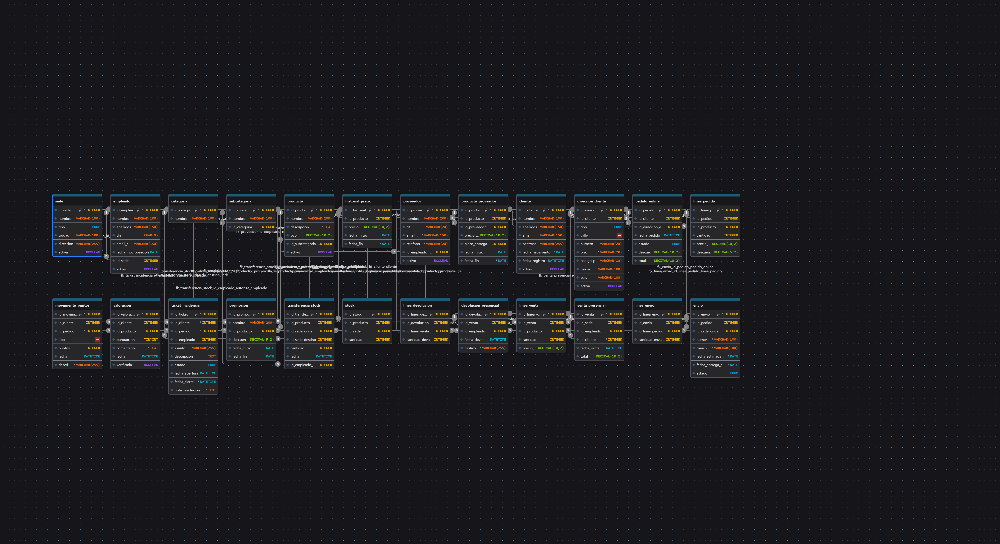

# 🛒 NexShop

> Sistema de Base de Datos Relacional para una Plataforma de Comercio Electrónico desarrollado con MySQL.


---

# 📖 Descripción

NexShop es un proyecto de diseño e implementación de una base de datos relacional para la gestión de una tienda online. El sistema permite organizar y gestionar información relacionada con clientes, productos, pedidos y ventas mediante una estructura de datos eficiente y normalizada.

Este proyecto fue desarrollado como práctica de Bases de Datos Relacionales utilizando MySQL, Laragon y DBeaver.

---

# 🚀 Tecnologías Utilizadas

| Tecnología | Descripción |
|------------|-------------|
| MySQL | Sistema gestor de bases de datos |
| SQL | Lenguaje de definición y consulta |
| Laragon | Entorno local de desarrollo |
| DBeaver | Administración y modelado de bases de datos |
| GitHub | Control de versiones |

---

# 📂 Estructura del Proyecto

```text
NexShop/
│
├── schema.sql
├── datos.sql
├── consultas.sql
├── modelo_relacional.md
├── memoria.md
├── README.md
│
└── docs/
    ├── diagrama-er.png
    ├── dbeaver.png
    └── laragon.png
```

---

# 🏗️ Modelo Entidad-Relación

El diseño de la base de datos fue realizado y documentado mediante DBeaver.

## Diagrama ER

> Exporta el diagrama desde DBeaver y guárdalo como:

```text
docs/diagrama-er.png
```

Después GitHub lo mostrará automáticamente:

```markdown

```



---

# ⚙️ Instalación

## 1. Clonar el repositorio

```bash
git clone https://github.com/TU-USUARIO/NexShop.git
cd NexShop
```

## 2. Iniciar MySQL con Laragon

Abrir Laragon y comprobar que el servicio MySQL está iniciado.

## 3. Crear la base de datos

```sql
CREATE DATABASE nexshop;
USE nexshop;
```

## 4. Crear las tablas

Ejecutar:

```sql
SOURCE schema.sql;
```

o abrir el archivo desde DBeaver y ejecutarlo.

## 5. Insertar los datos

```sql
SOURCE datos.sql;
```

## 6. Ejecutar las consultas

```sql
SOURCE consultas.sql;
```

---

# 📊 Funcionalidades Implementadas

- Creación de tablas relacionales.
- Claves primarias y foráneas.
- Integridad referencial.
- Inserción de datos de prueba.
- Consultas SQL.
- Modelo relacional documentado.
- Normalización de datos.
- Gestión de clientes y pedidos.

---

# 🔍 Ejemplos de Consultas

### Obtener todos los productos

```sql
SELECT *
FROM productos;
```

### Obtener todos los clientes

```sql
SELECT *
FROM clientes;
```

### Obtener todos los pedidos

```sql
SELECT *
FROM pedidos;
```

### Productos más vendidos

```sql
SELECT
    p.nombre,
    SUM(dp.cantidad) AS total_vendido
FROM detalle_pedido dp
JOIN productos p
    ON p.id_producto = dp.id_producto
GROUP BY p.nombre
ORDER BY total_vendido DESC;
```

### Total de ventas realizadas

```sql
SELECT
    SUM(total) AS ventas_totales
FROM pedidos;
```

---

# 🖥️ Herramientas Utilizadas

## Laragon

Laragon se utilizó como entorno local para:

- Gestionar MySQL.
- Ejecutar el servidor local.
- Realizar pruebas de la base de datos.

### Captura

```markdown

```

---

## DBeaver

DBeaver se utilizó para:

- Crear el modelo relacional.
- Administrar la base de datos.
- Ejecutar consultas SQL.
- Visualizar las relaciones entre tablas.

### Captura

```markdown

```

---

# 📚 Documentación

La documentación completa se encuentra en los siguientes archivos:

- `memoria.md`
- `modelo_relacional.md`
- `schema.sql`
- `consultas.sql`

---

# 🎯 Objetivos del Proyecto

- Diseñar una base de datos relacional eficiente.
- Aplicar conceptos de normalización.
- Garantizar la integridad de los datos.
- Practicar SQL avanzado.
- Gestionar información de una tienda online.

---

# 💡 Aprendizajes Adquiridos

Durante el desarrollo de este proyecto se trabajó con:

- Diseño de bases de datos relacionales.
- Relaciones entre tablas.
- Claves primarias y foráneas.
- Normalización.
- Consultas SQL.
- Gestión de bases de datos con DBeaver.
- Configuración de MySQL mediante Laragon.
- Uso de Git y GitHub para control de versiones.

---

# 👨‍💻 Autor

**Joaquín Suñe**

Proyecto académico desarrollado para la asignatura de Bases de Datos.

---

# 📄 Licencia

Este proyecto tiene fines educativos y de aprendizaje.

